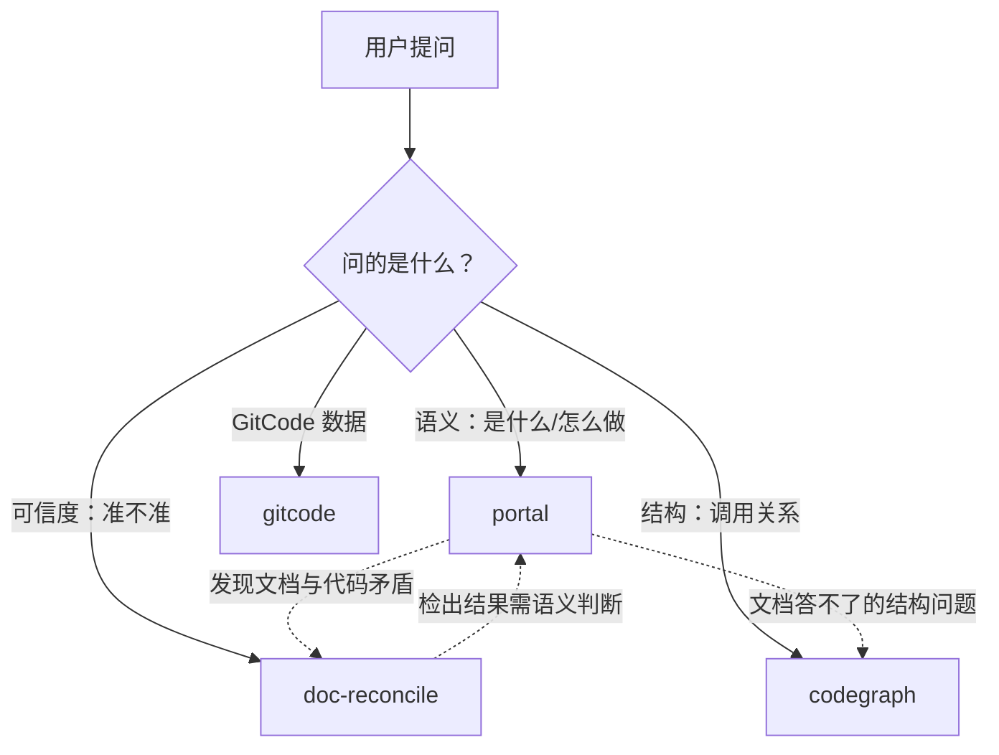

# 插件使用指南

## 一句话定位

**这个插件不生产知识，它盘点和校验团队已经写在仓库里的知识。**

团队把知识写在 `CLAUDE.md`、`.claude/skills/` 里，但会**静默过期**——
文档不会告诉你它有问题。本插件的价值是**发现文档不可信**，而不是替文档写内容。

## 能力路由（最重要的一节）

| 用户想问 | 用什么 |
|---|---|
| "这个项目是干嘛的""怎么上手""怎么参与" | **`portal`** |
| "这份文档准不准""新人能不能照着做""是不是过期了" | **`doc-reconcile`** |
| "这个函数被谁调用""改了会影响什么""调用链是什么" | **codegraph** |
| "GitCode 上那个 issue/PR 是什么情况" | **gitcode** |
| "怎么上测试环境""怎么部署上线" | **都不行**——超出范围，见文末 |

**判断口诀**：

- 问**语义**（是什么、怎么做）→ `portal`
- 问**可信度**（准不准、对不对得上）→ `doc-reconcile`
- 问**代码结构**（调用关系、影响面）→ codegraph
- 问**GitCode 平台数据** → gitcode

## 四个能力分别是什么

### `portal` —— 知识门户

按优先级读取仓库已有的门户文档（`.claude/skills/` → `CLAUDE.md`/`AGENTS.md`
→ `README.md`），回答"是什么、怎么组织、怎么参与"，**每条结论标注来源
`文件:行号`**，并**如实说明覆盖边界**。

关键：它**不**把自己读代码推断的内容混进文档结论里。文档没覆盖的，
它会明说"答不了"。

### `doc-reconcile` —— 文档对账

跑机械对账，检出四类问题：

| 类 | 检什么 |
|---|---|
| A | 悬空引用——文档声称的文件/目录不存在 |
| B | 覆盖缺口——仓库顶层内容文档从未提及 |
| C | skill 引用——文档声称的 skill 不存在 |
| D | skill 文档自身的悬空引用 |

**输出有噪声，必须分级筛选后再报给用户**，不要直接丢原始输出。

### `codegraph` —— 代码知识图谱（MCP）

查符号、调用链、影响面（blast radius）。

**它是本插件里唯一能回答"结构性问题"的能力**——这类问题文档和
`portal` 都答不了。

### `gitcode` —— GitCode 仓库查询（MCP）

读写 GitCode 的 issue / PR / 里程碑 / 看板。

**只在仓库托管在 GitCode 时才有用**（团队组织：`pipelineascode`）。
GitHub 上的仓库请用 `gh` CLI，不要用这个。

## 典型组合

**组合流程 A：新人上手一个仓库**

1. 先 `portal` —— 拿到分层答案 + 来源
2. 如果 `portal` 报告文档与实况矛盾 → 跑 `doc-reconcile` 做系统对账
3. 如果问的是调用链/影响面 → 退到 codegraph

**组合流程 B：评估一个仓库的文档能不能信**

1. 先 `doc-reconcile` —— 机械对账，快且不依赖模型判断
2. 语义层面的矛盾（环境变量名不符、描述与行为不符）**它检不出**，
   需要 `portal` 同时读文档和代码才暴露
3. **两者覆盖的失效类型几乎不重叠，缺一不可**

## 前置条件与故障排查

两个 MCP 的失败方式**完全不同**，遇到问题时先看这里：

### codegraph 需要先建索引

**症状**：工具能调用，但返回"isn't indexed with codegraph"。

**原因**：该仓库没有 `.codegraph/` 目录。

**处理**：**不要自己跑 `codegraph init`**——建索引是用户的决定（耗时、
占磁盘）。如实告诉用户可以建，让他选；本会话改用 Read/Grep/Glob。

### gitcode 需要环境变量 `GITCODE_TOKEN`

**症状**：**工具根本不在你的工具列表里**（不是调用失败，是压根没有）。

**原因**：`GITCODE_TOKEN` 未设置。该 server 在**启动时**校验 token，
无效则整个 server 不启动。

**处理**：告诉用户需要设置 `GITCODE_TOKEN` 环境变量并重启会话。
**不要在对话里索要 token 明文**。

### MCP 工具名带命名空间

实际工具名是 `mcp__plugin_knowledge-plugin_codegraph__codegraph_explore`
这类**全名**，不是你直觉里的短名 `codegraph_explore`。

**排查工具是否存在时，用全名**。用短名去问会得到"不存在"的答复，
那是名字不对，不是工具没装上。

## 这个插件不做什么

| 不做 | 说明 |
|---|---|
| **测试环境 / 部署上线** | 明确划在范围外，由独立模块承载。被问到要**如实说答不了**，不要硬答 |
| 生成/补全文档 | 只盘点与校验，不替团队写内容 |
| 跨仓库关系分析 | 当前非痛点 |
| 替代 `gh` 查 GitHub | GitHub 仓库用 `gh` CLI，不用 gitcode |

**范围仅限本团队仓库**，不是整个 opensourceways 组织。

## 一条原则

**静默的空白比明确的空白更危险。**

不知道就说不知道，不要用推断填补文档的空白却不说——那会让用户以为
"文档里写了"，从而失去自己去看的机会。
